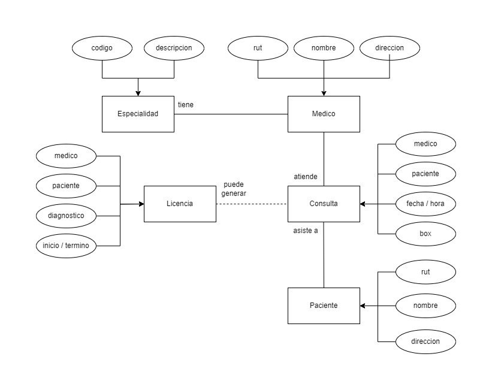
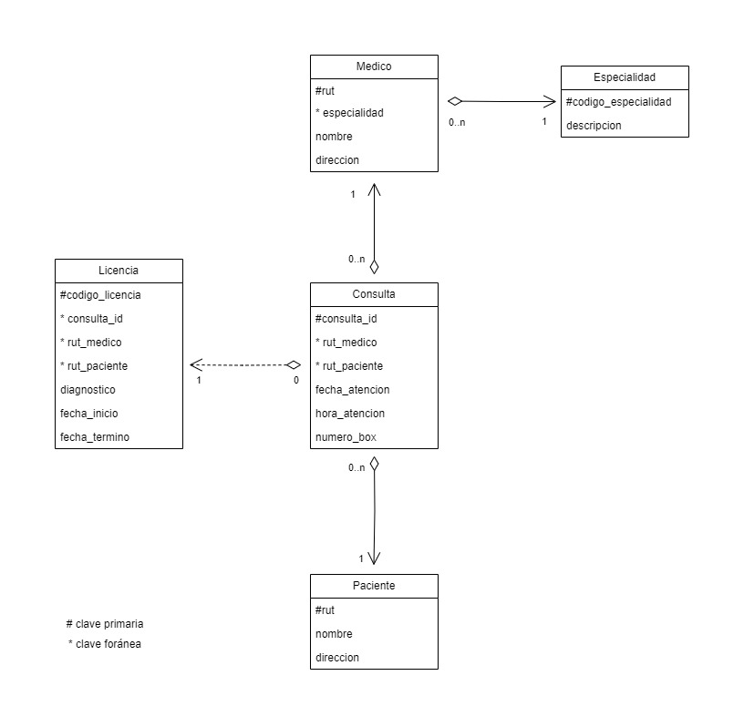
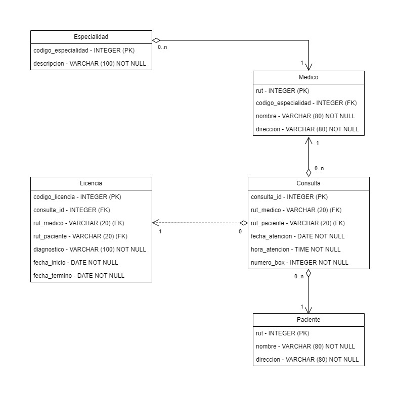

# Proyecto Modelo Entidad-Relación: Consultas Médicas

Este proyecto implementa una base de datos para el seguimiento de consultas médicas, médicos, pacientes y licencias médicas. El diseño de la base de datos se basa en un modelo entidad-relación.

## Instrucciones para ejecutar los archivos SQL

1. **Creación de la base de datos y tablas:**
   - Ejecuta el archivo `script_implementacion.sql` para crear la base de datos y las tablas. Puedes ejecutar este script desde el shell de PostgreSQL con el siguiente comando:
   - \i script_implementacion.sql

2. **Poblamiento de las tablas:**
   - Ejecuta el archivo `script_inserciones.sql` para poblar las tablas con datos. Puedes ejecutar este script desde el shell de PostgreSQL con el siguiente comando:
   - \i script_inserciones.sql

## Imágenes del modelo relacional

Se adjuntan tres imágenes que representan el modelo entidad-relación en diferentes niveles de abstracción:

1. **Modelo Conceptual:**
   

2. **Modelo Lógico:**
   

3. **Modelo Físico:**
   

## Diccionario de la base de datos

### Tabla `especialidad`

- `cod_especialidad` (INTEGER): Identificador único de la especialidad.
- `descripcion` (VARCHAR(100)): Descripción de la especialidad.

### Tabla `medico`

- `rut` (VARCHAR(20)): Rut del médico, clave primaria.
- `cod_especialidad` (INTEGER): Clave foránea que referencia el código de especialidad en la tabla `especialidad`.
- `nombre` (VARCHAR(80)): Nombre del médico.
- `direccion` (VARCHAR(80)): Dirección del médico.

### Tabla `paciente`

- `rut` (VARCHAR(20)): Rut del paciente, clave primaria.
- `nombre` (VARCHAR(80)): Nombre del paciente.
- `direccion` (VARCHAR(80)): Dirección del paciente.

### Tabla `consulta`

- `consulta_id` (SERIAL): Identificador único de la consulta.
- `rut_medico` (VARCHAR(20)): Rut del médico que realizó la consulta, clave foránea.
- `rut_paciente` (VARCHAR(20)): Rut del paciente atendido, clave foránea.
- `fecha_atencion` (DATE): Fecha de la consulta.
- `hora_atencion` (TIME): Hora de la consulta.
- `nro_box` (INTEGER): Número del box donde se realizó la consulta.

### Tabla `licencia`

- `cod_licencia` (INTEGER): Identificador único de la licencia.
- `consulta_id` (INTEGER): Clave foránea que referencia la consulta asociada a la licencia.
- `rut_medico` (VARCHAR(20)): Rut del médico que emitió la licencia, clave foránea.
- `rut_paciente` (VARCHAR(20)): Rut del paciente beneficiario de la licencia, clave foránea.
- `diagnostico` (VARCHAR(100)): Diagnóstico asociado a la licencia.
- `fecha_inicio` (DATE): Fecha de inicio de la licencia.
- `fecha_termino` (DATE): Fecha de término de la licencia.

## Archivo de guía de implementación

Se incluye un archivo PDF llamado `guia_implementacion.pdf` que proporciona instrucciones detalladas sobre cómo implementar la base de datos y cómo realizar operaciones básicas con ella.

## Autor

Jose Contreras Stoltze
